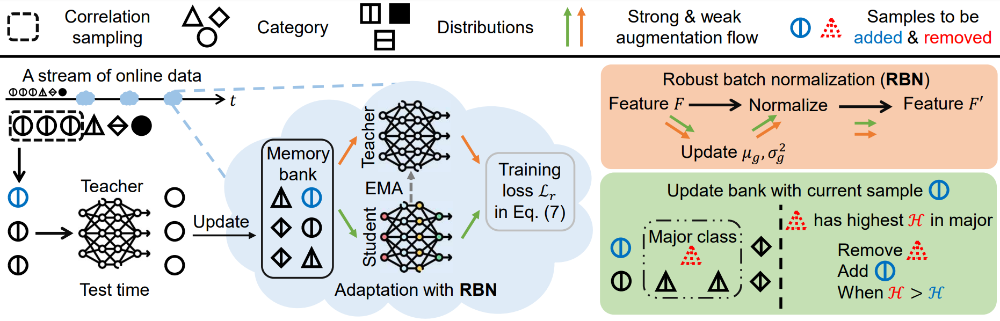

 ---

<div align="center">    
 
# Robust Test-Time Adaptation in Dynamic Scenarios (CVPR 2023)

[Longhui Yuan](https://yuanlonghui.github.io), [Binhui Xie](https://binhuixie.github.io), [Shuang Li](https://shuangli.xyz)


[](https://arxiv.org/abs/2303.13899)&nbsp;&nbsp;

</div>

- [Overview](#overview)
- [Prerequisites Installation](#prerequisites-installation)
- [Datasets Preparation](#datasets-preparation)
- [Code Running](#code-running)
- [Citation](#citation)
- [Contact](#contact)


## Overview
We propose a new test-time adaptation setup that is more suitable for real-world applications, namely practical test-time adaptation (PTTA). 
PTTA considers both distribution changing and correlation sampling.
Meanwhile, we propose a robust test-time adaptation (RoTTA) method, which has a more comprehensive consideration of the challenges of PTTA.




## Prerequisites Installation

## Datasets Preparation

## Code Running

## Citation

## Contact

PyTorch's implementation for RoTTA.

Firstly, create environment by
```bash
conda create -n rotta python=3.9.0
conda activate rotta
pip install -r requirements.txt
```

Link dataset by
```bash
ln -s path_to_cifar10_c datasets/CIFAR-10-C
ln -s path_to_cifar100_c datasets/CIFAR-100-C
```

Run RoTTA by
```bash
python ptta.py \
      -acfg configs/adapter/rotta.yaml \
      -dcfg configs/dataset/cifar10.yaml \
      OUTPUT_DIR RoTTA/cifar10

python ptta.py \
      -acfg configs/adapter/rotta.yaml \
      -dcfg configs/dataset/cifar100.yaml \
      OUTPUT_DIR RoTTA/cifar100
```
